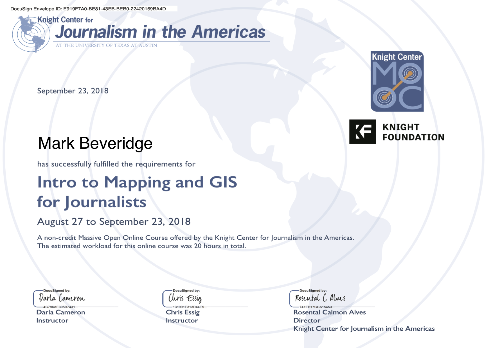

# Knight Center MOOC : "[Intro to Mapping and GIS for Journalists](https://journalismcourses.org/MAP0918.html)"
###### 27/8/18 - 23/9/18

Darla Cameron & Chris Essig [Texas Tribune]

## Syllabus
### Module 1: When to make a map
This week, we’ll talk about the basic principles of map-making and what kind of data makes a good map. We’ll also start using QGIS to explore geographic data. You will learn:

* When a map can help tell a story, and when it cannot.
* Cartographic basics — latitude and longitude, projections and scale.
* The different types of geographic data — vector points, lines and shapes and raster images, and how to open and manipulate spatial data in QGIS.

### Module 2: Combining geographic data
This week, we’ll dig into how and why journalists combine geographic datasets with other data to tell really great stories. You will learn:

* When and why to put multiple pieces of data on the same map.
* How to geocode data and make a dot map.
* How to join datasets together inside QGIS to make something with a sum greater than its parts.
* How to edit data in QGIS to make adjustments on the fly.

### Module 3: 
This week, we will dive deeper into how you can analyze data to make more complex maps. We’ll talk about how to draw story-worthy conclusions from what you find. You will learn:

* How two Washington Post journalists analyzed racial data to create amazingly detailed dot-density segregation maps — and how to use this technique with your own data.
* Three useful ways to analyze data in QGIS: points in a polygon, dot density and point buffers.

### Module 4: 
This week, we will talk about visualizing data and learn some design principles to keep in mind when publishing maps online or in print. We’ll also discuss how to take your new geographic skills to the next level.You will learn:

* How to avoid accidentally making a population density map.
* Two methods for simplifying data.  
* How to export a map from QGIS and next steps to get it ready for publication.
* What digital publication tools journalists & media practitioners use to tell stories with maps on the internet.

---

